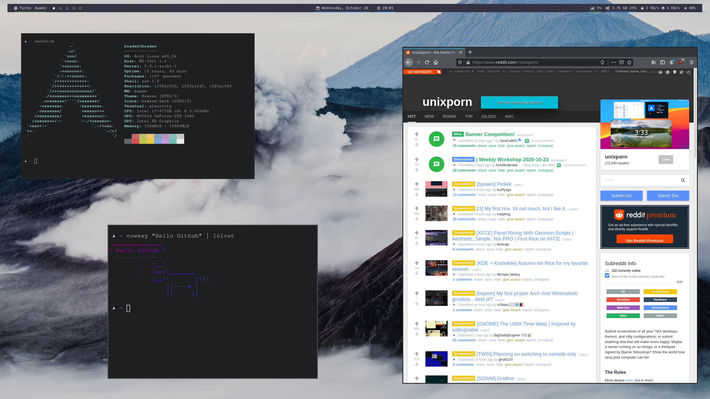

# dotfiles

A collection the dotfiles I use in my daily workflow.



My current setup is using [bwpsm](https://github.com/baskerville/bspwm) as my window manager, [sxhkd](https://github.com/baskerville/sxhkd), [rofi](https://github.com/davatorium/rofi) as a launcher, and [polybar](https://github.com/polybar/polybar) as a status bar.

## Requirements

See the respective pages for [bwpsm](https://github.com/baskerville/bspwm) / [sxhkd](https://github.com/baskerville/sxhkd) / [rofi](https://github.com/davatorium/rofi) / [polybar](https://github.com/polybar/polybar) for dependencies, or consider using a package manager like the [AUR](https://aur.archlinux.org/) with [yay](https://github.com/Jguer/yay) to make installation of these easier, if running something like [Arch](https://www.archlinux.org/) / [Manjaro](https://manjaro.org/) / [Artix](https://artixlinux.org/)

### zsh

The pre-requisites for my ``zsh`` configuration are:

* [ruby](https://www.ruby-lang.org/en/) and [rubygems](https://rubygems.org/)
* [pip](https://pypi.org/project/pip/)
* [curl](https://curl.haxx.se/)

Everything else is either already there or will be installed.

## Dotfiles

Dotfiles are given for the following:

* [bwpsm](https://github.com/baskerville/bspwm)
* [sxhkd](https://github.com/baskerville/sxhkd)
* [rofi](https://github.com/davatorium/rofi)
* [polybar](https://github.com/polybar/polybar)

These can be located in [``.config``](https://github.com/bradendubois/dotfiles/tree/master/.config).

### zsh

The ``zshrc`` file relies on [antibody](https://getantibody.github.io/) to manage plugins.

* Standard [oh-my-zsh](https://github.com/ohmyzsh/ohmyzsh) plugins:
  * git
  * wd
* Other plugins:
  * [Valiev/almostontop](https://github.com/Valiev/almostontop)
  * [Cloudstek/zsh-plugin-appup](https://github.com/Cloudstek/zsh-plugin-appup)
  * [arzzen/calc.plugin.zsh](https://github.com/arzzen/calc.plugin.zsh)
  * [ael-code/zsh-colored-man-pages](https://github.com/ael-code/zsh-colored-man-pages)
  * [zsh-users/zsh-completions](https://github.com/zsh-users/zsh-completions)
  * [athityakumar/colorls](https://github.com/athityakumar/colorls)
  * [igoradamenko/npm.plugin.zsh](https://github.com/igoradamenko/npm.plugin.zsh)
  * [geometry-zsh/geometry](https://github.com/geometry-zsh/geometry)

- Ruby is used to install [athityakumar/colorls](https://github.com/athityakumar/colorls), making ``ls`` far prettier.
- Pip is used to install [pwittchen/spotify-cli-linux](https://github.com/pwittchen/spotify-cli-linux), which allows some easy Spotify access from the command-line.

## Installation

### dotfiles

For any of the dotfiles in [``.config``](https://github.com/bradendubois/dotfiles/tree/master/.config), the directory can be put in one's own home directory's ``.config``. For example. if one wanted to use [``my bspwmrc file``](https://github.com/bradendubois/dotfiles/blob/master/.config/bspwm/bspwmrc), it would go to ``$HOME/.config/bspwm/bspwmrc``.

### zsh setup

1. Clone the repository:

```sh
git clone https://github.com/bradendubois/dotfiles <dotfile_location>
```

where ``<dotfile_location>`` is the desired location on your machine for this repository.

2. Navigate to the location of the cloned repository:
```sh
cd <dotfile_location>
```

3. Open the file ``zshrc`` in your text editor of choice. Edit the following line:

```sh
export DOTFILES="$HOME/dotfiles"
```

such that ``DOTFILES`` points to wherever the repository is located on your machine.

4. Remove any old ``.zshrc`` file from your home directory.

```sh
rm ~/.zshrc
```

5. Symlink the new ``.zshrc`` file in the dotfiles repository.

```sh
ln zshrc ~/.zshrc
```

6. Restart your terminal session.

7. Install [antibody](https://getantibody.github.io/).

8. Run the following:

```sh
antibody bundle < $ZSH/zsh_plugins.txt > $ZSH/zsh_plugins.sh
```

#### Optional Extras

9. Install [pwittchen/spotify-cli-linux](https://github.com/pwittchen/spotify-cli-linux) using [pip](https://pypi.org/project/pip/):
```sh
sudo pip install spotify-cli-linux
```

10. Install  [athityakumar/colorls](https://github.com/athityakumar/colorls) using [rubygems](https://rubygems.org/):
```sh
gem install colorls
```

**Note**: You may need to tweak your ``$PATH`` to include ``ruby``. See the file ``dotfiles/zsh/path`` for the easiest way to do so.

## Acknowledgements

* The repository [unixorn/awesome-zsh-plugins](https://github.com/unixorn/awesome-zsh-plugins#plugins) provided an awesome starting point for finding tons of incredibly useful plugins.
* The subreddit [r/unixporn](https://www.reddit.com/r/unixporn/) is exceptionally creative and provides many great dotfiles setups to take (rightfully attributed!) inspiration from.
