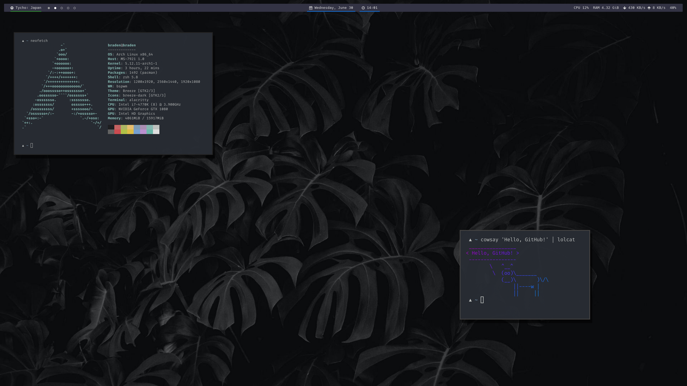

# dotfiles

A collection the dotfiles I use in my daily workflow.



## Getting Started

My current setup is using [bwpsm](https://github.com/baskerville/bspwm) as my window manager, [sxhkd](https://github.com/baskerville/sxhkd), [rofi](https://github.com/davatorium/rofi) as a launcher, and [polybar](https://github.com/polybar/polybar) as a status bar.

My preferred shell is **zsh**. The ``zshrc`` file relies on [antibody](https://getantibody.github.io/) to manage plugins.

* [oh-my-zsh](https://github.com/ohmyzsh/ohmyzsh)
* [Valiev/almostontop](https://github.com/Valiev/almostontop)
* [Cloudstek/zsh-plugin-appup](https://github.com/Cloudstek/zsh-plugin-appup)
* [arzzen/calc.plugin.zsh](https://github.com/arzzen/calc.plugin.zsh)
* [ael-code/zsh-colored-man-pages](https://github.com/ael-code/zsh-colored-man-pages)
* [zsh-users/zsh-completions](https://github.com/zsh-users/zsh-completions)
* [athityakumar/colorls](https://github.com/athityakumar/colorls)
* [igoradamenko/npm.plugin.zsh](https://github.com/igoradamenko/npm.plugin.zsh)
* [geometry-zsh/geometry](https://github.com/geometry-zsh/geometry)

### General Requirements

See the respective pages for [bwpsm](https://github.com/baskerville/bspwm) / [sxhkd](https://github.com/baskerville/sxhkd) / [rofi](https://github.com/davatorium/rofi) / [polybar](https://github.com/polybar/polybar) for dependencies, or consider using a package manager like the [AUR](https://aur.archlinux.org/) with [yay](https://github.com/Jguer/yay) to make installation of these easier, if running something like [Arch](https://www.archlinux.org/) / [Manjaro](https://manjaro.org/) / [Artix](https://artixlinux.org/)

### ZSH Requirements

The pre-requisites for my ``zsh`` configuration are:

* [ruby](https://www.ruby-lang.org/en/) and [rubygems](https://rubygems.org/)
* [pip](https://pypi.org/project/pip/)
* [curl](https://curl.haxx.se/)

## Installation

Many components can be installed by simply linking or copying files from [config](config) to the `$HOME/.config` or equivalent directory.

To install all or most of the included files, first:

1. Clone the repository:
```sh
git clone https://github.com/bradendubois/dotfiles <dotfile_location>
```

where ``<dotfile_location>`` is the desired location on your machine for this repository.

2. Navigate to the location of the cloned repository:
```sh
cd <dotfile_location>
```

3. Open the file ``zshrc`` in your text editor of choice. Edit the following line:
```sh
export DOTFILES="$HOME/dotfiles"
```

such that ``DOTFILES`` points to wherever the repository is located on your machine.

### zsh

1. Remove any old ``.zshrc`` file from your `$HOME`.
```sh
rm ~/.zshrc
```

2. Symlink the new ``.zshrc`` file in the dotfiles repository.
```sh
ln zshrc ~/.zshrc
```

3. Restart your terminal session.

4. Install [antibody](https://getantibody.github.io/).

5. Run the following:
```sh
antibody bundle < $ZSH/zsh_plugins.txt > $ZSH/zsh_plugins.sh
```

See the section **Static loading** [here](https://getantibody.github.io/usage/) for more details on bundling.

### VS Code

A list of extensions for [Visual Studio Code](https://code.visualstudio.com/) is provided at [config/code-extensions](config/code-extensions). Once VS Code has been installed, all extensions can be installed with:

```shell
cat config/code-extensions | xargs -n 1 code --install-extension
```

Optionally, **keybindings** and **settings** are also provided in [config/Code/User/](config/Code/User/){[keybindings.json](config/Code/User/keybindings.json), [settings.json](config/Code/User/settings.json)}. These can be linked to the same directory under `$HOME/.config`.

### Vim / Nvim

To manage plugins for Vim / Nvim (though I use Nvim), install [junegunn/vim-plug](https://github.com/junegunn/vim-plug).

After linking the `init.vim` [file](config/nvim/init.vim) under [config/nvim](config/nvim), run:
```shell
:PlugInstall
```

### Picom

While any [picom](https://wiki.archlinux.org/title/Picom) source should work, the [ibhagwan/picom](https://github.com/ibhagwan/picom) fork supports rounded corners, which is included in [my .conf file](config/picom/picom.conf).

If using a distro like Arch Linux, Manjaro, or Artix Linux, the `picom-ibhagwan-git` package will work.

```sh
pacaur -S picom-ibhagwan-git
```

### Optional Extras

1. [athityakumar/colorls](https://github.com/athityakumar/colorls) can be used to make ``ls`` far prettier.

Install using [rubygems](https://rubygems.org/):
```sh
gem install colorls
```

**Note**: You may need to tweak your ``$PATH`` to include ``ruby``. See the file ``dotfiles/zsh/path`` for the easiest way to do so.

2. [pwittchen/spotify-cli-linux](https://github.com/pwittchen/spotify-cli-linux) allows some easy Spotify access from the command-line.

Install using [pip](https://pypi.org/project/pip/):
```sh
sudo pip install spotify-cli-linux
```

## Acknowledgements

* The repository [unixorn/awesome-zsh-plugins](https://github.com/unixorn/awesome-zsh-plugins#plugins) provided an awesome starting point for finding tons of incredibly useful plugins.
* The subreddit [r/unixporn](https://www.reddit.com/r/unixporn/) is exceptionally creative and provides many great dotfiles setups to take (rightfully attributed!) inspiration from.
